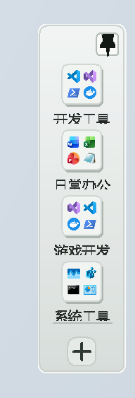
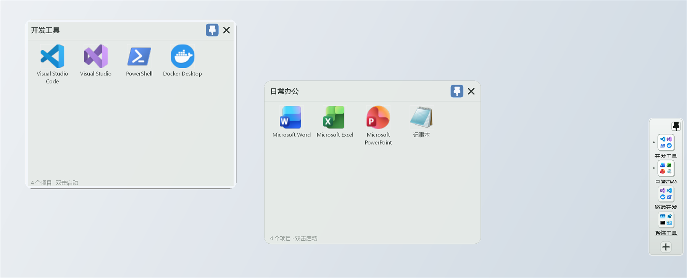

# LightLaunch

LightLaunch 是一个只做一件事的 Windows 应用分组启动器：把下载或安装的软件放进自定义分组，然后快速打开。

当前版本是项目 MVP。它采用原生 C++/Win32，不依赖 .NET、Qt、Electron、WebView 或后台服务。

## 界面展示

<p align="center">
  
</p>

<p align="center"><em>鼠标触及屏幕右缘，即可快速展开带 2×2 图标预览的分组 Dock。</em></p>



*多个分组围栏可同时展开，并分别移动、缩放、固定和关闭。*

## 已实现

- 启动后隐藏驻留；鼠标触及当前显示器工作区最右缘后快速展开，移出后快速收回
- 右缘分组页使用 macOS Dock 风格的窄幅半透明圆角托盘，分组图标按单列直接排列；托盘高度随分组数量变化，每个小文件夹预览该组前 4 个目标图标
- Dock 右上角小图钉可独立锁住分组页；取消固定后恢复鼠标离开自动收回（固定状态仅本次运行有效）
- 新建、重命名和删除分组
- 按住分组图标拖到另一个分组位置，可调整 Dock 中的分组顺序并自动保存
- 每个分组都有一个与右缘 Dock 同色的浅色半透明玻璃围栏：标题栏略实、内容区更通透，并使用白色外描边和灰绿色内描边；可同时打开多个围栏，不会在切换分组时替换或关闭已有围栏
- 每个围栏都可拖动到桌面任意位置，并可从四边或四角自由调整大小；标题栏右上角提供独立图钉和关闭按钮
- Dock 与每个围栏的固定状态完全独立：固定 Dock 不会固定围栏，固定某个围栏也不会锁住 Dock 或其他围栏
- 右键分组可重命名或删除，右键托盘空白处可新建分组
- 向当前分组添加 `.exe`、`.lnk`、`.bat`、`.cmd`、`.url` 或普通文件
- 添加文件夹
- 在已打开分组的内容区右键空白处添加文件或文件夹，也可从资源管理器直接拖入一个或多个目标
- 自动读取目标名称和 Shell 图标
- 双击图标直接启动，按 `Enter` 也可启动
- 按住围栏中的内容图标拖到另一个图标位置，可调整当前分组内的内容顺序并自动保存
- 右键重命名、移动到其他分组、打开所在位置或移除
- UTF-16 本地配置，字符串字段采用可逆编码，支持中文、引号和带空格路径
- 原子保存并保留上一份配置备份
- 单实例运行
- Per-Monitor V2 DPI 和普通用户权限运行
- 启动后注册系统托盘图标；成功启动目标或关闭面板时自动隐藏
- 单击或双击托盘图标可显示右缘透明分组栏，右键托盘图标可显示或明确退出
- 从托盘选择“退出”后完全结束，不遗留后台进程

删除分组或启动项只会修改 LightLaunch 配置，不会删除原始应用、快捷方式或文件夹。

## 使用

1. 双击 `LightLaunch.exe`。
2. 把鼠标移到当前屏幕工作区的最右缘，竖向 Dock 托盘会自动展开。
3. 右键托盘空白处新建分组，例如“游戏开发”。
4. 左键点击小文件夹会打开该分组自己的桌面围栏；继续点击其他分组即可同时打开多个围栏。
5. 按住 Dock 中的分组图标并拖到另一个分组位置，可调整分组顺序。
6. 拖动围栏标题栏可移动位置，从四边或四角拖动可调整大小；右上角图钉只固定当前围栏，`×` 只隐藏当前围栏。
7. 在围栏内容区空白处右键添加应用、普通文件或文件夹，也可以直接把目标拖入；按住内容图标拖到另一个图标位置可调整内容顺序，双击内容图标启动，右键图标可重命名、移动或移除。
8. 未固定的 Dock 和围栏在鼠标离开后各自收回；需要持续显示哪个界面，就单独点击它自己的图钉。
9. 点击托盘图标也可展开；右键托盘图标选择“退出”可完全结束。

配置保存在：

```text
%LOCALAPPDATA%\LightLaunch\config.ini
```

上一份有效配置保存在同目录的 `config.ini.bak`。

## Codex 快速操作

需要让 Codex 代为新建分组、添加应用、文件或文件夹时，可以直接提供分组名称和目标的完整路径。具体请求格式、应用内步骤、配置格式及安全写入规则见 [LightLaunch 的 Codex 操作指南](AGENTS.md)。

## 构建

要求：

- Windows 10/11 x64
- Visual Studio 2022，安装“使用 C++ 的桌面开发”
- CMake 3.25 或更高版本

在 PowerShell 中执行：

```powershell
.\scripts\build.ps1
```

或手动执行：

```powershell
cmake --preset msvc-x64
cmake --build --preset release
ctest --preset release
cmake --install build --config Release --prefix dist
```

最终程序位于：

```text
dist\LightLaunch.exe
```

## 轻量化原则

- 不安装后台服务；仅在用户主动启动后以单进程托盘驻留
- 右缘检测采用轻量级窗口定时器，不安装全局鼠标钩子
- 不联网、不遥测
- 不扫描整台电脑
- 不包含插件系统、主题引擎或动画框架
- 按当前 Dock 滚动视口分批异步读取每组前 4 个预览图标，并少量预取相邻分组；每个已打开围栏拥有独立的按需图标缓存
- Release 使用静态 CRT，发布单个 EXE
- 从托盘退出后不遗留后台进程

产品范围、性能门槛和阶段计划见 `docs/PROJECT_CHARTER.md`，本次构建的验证结果见 `docs/VERIFICATION.md`。
